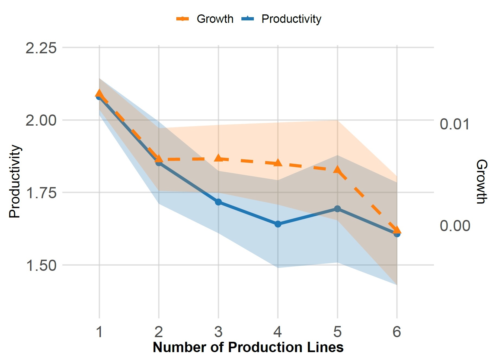

---

##### Download

+ [Paper](KESKIN_JMP.pdf)
+ [Code and data](Added Soon)

---

##### Abstract

Horizontal expansion through an increasing product portfolio lies at the core of modern endogenous growth literature. Yet evidence remains limited on how diversification across industries influences a firm's trade-off between generating social surplus and capturing private returns. To investigate this, I categorize intangible assets by their spillovers: transferable intangibles (patents, software) generate social surplus, whereas embedded intangibles (organizational capital, brand value) primarily yield private returns. I document that diversified firms reallocate investment toward embedded intangibles, a strategic shift accompanied by declining markups and productivity, as well as reduced innovation by their rivals. Motivated by this evidence, I extend a canonical endogenous-growth framework to endogenize firms' allocation between transferable and embedded intangibles while allowing for both horizontal and vertical expansion. A key prediction of the model is that embedded intangibles are the primary driver of a firm's ability to expand across industries, which also raises entry barriers for competitors and decreases social return rather than promoting long-run growth. Thus, the shift in innovative effort ultimately sacrifices economy-wide growth for firm-level market advantages, and quantitative analysis indicates that size-dependent taxes can substantially improve welfare.

---

##### Figure 1: Productivity and Growth Rate by Production Lines

---

 ##### Related material

+ [Presentation slides](Added Soon)