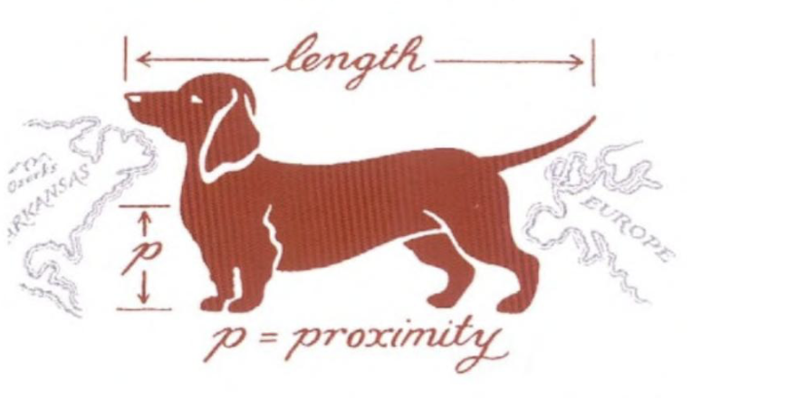

---

##### Download

+ [Paper](paper2.pdf)

---

##### Abstract

In December 2017, the United States Congress passed the Tax Cut and Jobs Act (TCJA), significantly reducing the corporate tax rate and introducing favorable policies for intangible assets. This paper aims to investigate the impact of the TCJA on various aspects of corporate behavior, including investments in intangibles, research and development (R&D) spending, and sales, general, and administrative (SG&A) expenses.  I employ the difference in difference method using Compustat data from 2014 to 2020 to measure investment differences and incorporate these values into the model I developed for my Step-by-Step Intangibles project. Additionally, the paper explores how this policy change affects average productivity levels, markups, and market concentration. Furthermore, the study analyzes the implications of the TCJA on capital misallocation compared to Canada.

---

##### Figure 1: Dimensions of a sausage dog

---