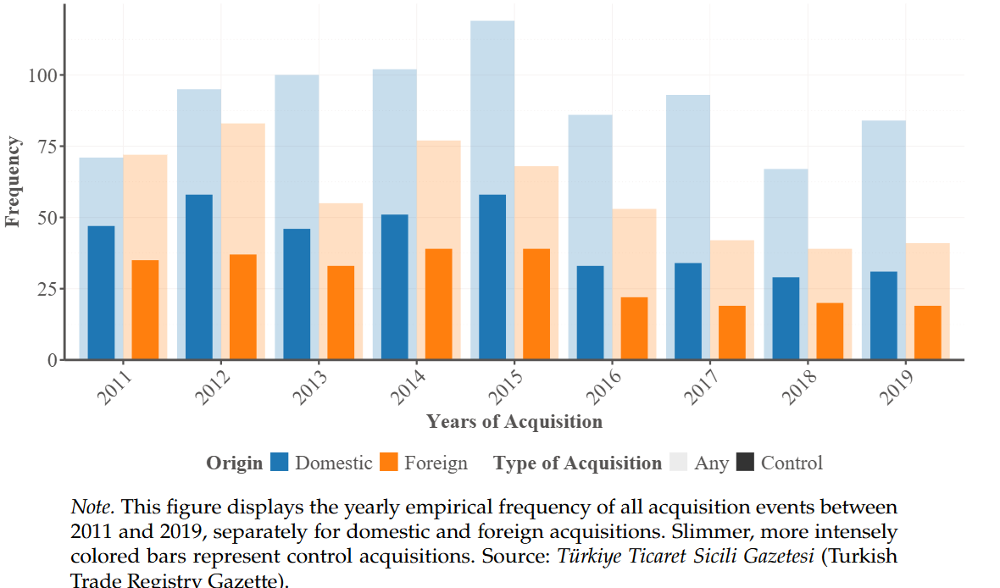

##### Authors

Cagin Keskin and [Paolo Zacchia](https://www.paolozacchia.com/)

---

##### Download

+ [Paper](Network Acquisitions Paper October 2025.pd)

---

##### Abstract

We study the effects of acquisitions on firms and their production networks in Türkiye using rich administrative firm-to-firm transaction data. Leveraging a staggered event-study design, we compare post-acquisition outcomes of target firms and their trading partners to matched controls. Acquisitions increase the intangible intensity of target firms but have no consistent effects on conventional performance measures. A key finding is that the network consequences of acquisitions depend on the acquirer’s origin. Domestic acquisitions lead to tangible capital deepening and strengthen existing buyer-supplier relationships along the intensive margin, while foreign acquisitions tend to shift production toward outsourcing and diversify network connections. We argue that these differences stem from variation in firms’ relationship capability: their ability to sustain productive links in a network governed by incomplete contracts.

---
##### Figure 1: Distribution of acquisitions over time

---