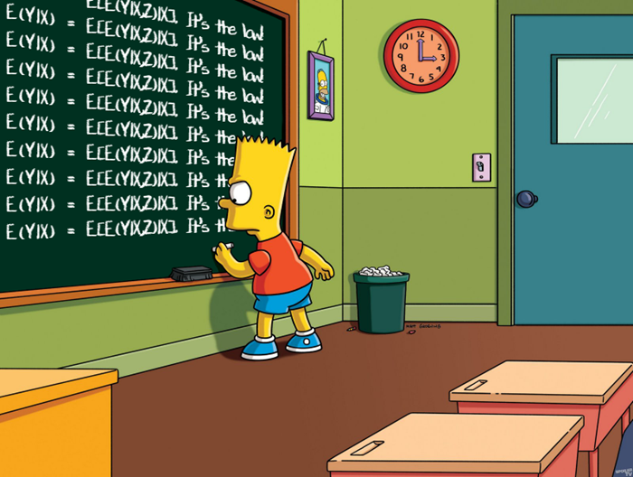

---

##### Abstract(Draft available upon request)

In this research, I investigate what caused the intangible over tangible ratio to increase. One explanation for the surge in intangible assets is the increase driven by globalization and skill-biased task specialization. Globalization has expanded market size and intensified competition, making the marginal cost advantage more significant through intangibles. This market size and competition increase encourages firms to invest more in intangible assets. Additionally, skill-biased task specialization enhances the importance of a firm's organizational capital. The underlying intuition is that the production of high-skill labor requires intensive management skills, prompting firms to invest more in organizational capital to manage the production process efficiently. To analyze the effects of globalization and skill-biased technological change on the intangible-to-tangible asset ratio, I incorporate directed technological change within the Schumpeterian step-by-step innovation model.

---

##### Figure 

---